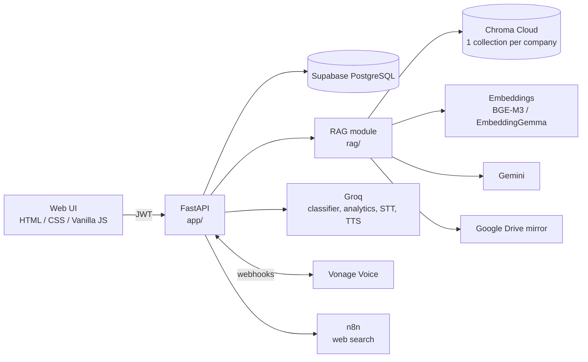

# AI Contact Center

A multi-tenant contact-center platform with **Arabic-first AI**: a per-company knowledge base with cited RAG answers, automated follow-up phone calls in Egyptian Arabic, voice input/output, and natural-language ticket analytics.

Companies manage their own agents, customers and tickets. Agents get a grounded knowledge assistant and can launch an AI follow-up call that classifies the customer's answer and updates the ticket automatically.


---

## Features

| Area | What it does |
|---|---|
| **Multi-tenancy & roles** | Three roles (Super Admin, Admin, Agent) with JWT authentication. Every query is scoped to the caller's company on the server. |
| **Knowledge Base (RAG)** | Per-company document upload (PDF, DOCX, TXT, MD), indexing and cited question answering in Arabic and English. |
| **AI follow-up calls** | Outbound calls through Vonage with Egyptian Arabic speech recognition. A Groq LLM classifies the reply as `resolved`, `not_resolved` or `unclear` and updates the ticket. |
| **Ticket analytics** | Natural-language questions over tickets and calls (17 metrics). The LLM selects an intent from a fixed schema and never writes SQL. |
| **Voice** | Arabic speech-to-text (Whisper) for questions and text-to-speech for answers. |
| **Chat sessions** | Persistent conversations with short-term memory so follow-up questions resolve correctly. |
| **Web search** | Optional web-search agent delegated to an n8n workflow (Tavily + Gemini). |
| **Drive mirror** | Optional copy of uploaded files to Google Drive, ready for an n8n ingestion workflow. |

---

## Architecture



### AI follow-up call flow

1. The Admin creates a ticket and assigns it to an Agent and a Customer.
2. The Agent presses **Start AI Call**. The backend creates a `Call` record and places an outbound Vonage call.
3. When the customer answers, Vonage requests `/api/v1/vonage/answer`. The backend returns an NCCO that plays the Arabic question and listens for speech (`ar-EG`).
4. The transcript is posted to `/api/v1/vonage/input` and classified by the Groq model.
5. The outcome is stored on the call. The ticket becomes `resolved` or `needs_agent`.
6. Low-confidence or unclear answers are retried once before the case is escalated to a human agent.
7. Vonage status events (`/events`) keep the call status, end time and duration in sync.

### Tenant isolation

Isolation is enforced twice, so a single mistake cannot expose another company's data:

1. **A separate vector collection per company** (`kb_company_{id}`).
2. **A mandatory `company_id` metadata filter** inside every retrieval query.

The company is always resolved server-side from the authenticated user. A value in a request body is never trusted. A Super Admin has no company of their own and must explicitly choose one through the `X-Company-Id` header.

---

## Tech stack

- **Backend:** Python 3.11+, FastAPI, SQLAlchemy 2, Alembic, Pydantic v2
- **Database:** Supabase PostgreSQL
- **Auth:** JWT (HS256), `pwdlib` password hashing
- **RAG:** PyMuPDF, BeautifulSoup, ChromaDB (Chroma Cloud), hybrid search (semantic + keyword with reciprocal rank fusion), cited answers
- **Embeddings:** BGE-M3 (default) or EmbeddingGemma through the Hugging Face Inference API
- **LLMs:** Gemini (RAG generation), Groq (call classification, analytics, speech)
- **Voice:** Vonage Voice API, Groq Whisper (STT) and Orpheus Arabic (TTS)
- **Automation:** n8n workflows (`use_Case1_n8n.json`, `use_Case2.json`)
- **Frontend:** single-page app in plain HTML, CSS and JavaScript (no framework, no build step)
- **Testing:** pytest

---

## Roles and permissions

| Capability | Super Admin | Admin | Agent |
|---|:-:|:-:|:-:|
| Manage companies and company admins | ✅ | | |
| Manage agents and customers | | ✅ | |
| Create and edit tickets | | ✅ | |
| Ticket analytics | | ✅ | |
| Upload and delete knowledge-base documents | ✅ (selected company) | ✅ | |
| Ask the knowledge assistant | ✅ (selected company) | ✅ | ✅ |
| View own follow-ups and start AI calls | | | ✅ |

---

## Project structure

```text
.
├── app/                    # Main FastAPI application
│   ├── api/                # Routers and auth dependencies
│   ├── core/               # Settings, JWT and password hashing
│   ├── db/                 # Engine, session, portable column types
│   ├── integrations/       # Vonage client
│   ├── models/             # SQLAlchemy models
│   ├── repositories/       # Data-access layer
│   ├── schemas/            # Pydantic request/response models
│   ├── services/           # Business logic: calls, classifier, analytics, speech
│   ├── audio/              # Pre-recorded Arabic call prompts
│   └── main.py
├── rag/                    # Knowledge-base and RAG module
│   ├── src/rag/            # chunking, documents, embeddings, vectorstore, llm, services, api, evaluation
│   ├── data/evaluation/    # Evaluation dataset and reports
│   ├── docs/               # Setup guides
│   └── tests/
├── frontend/               # Web UI (index.html, kb.html)
├── migrations/             # Alembic revisions
├── scripts/                # Helper scripts (create super admin, smoke tests)
├── tests/                  # Application tests
└── use_Case*.json          # n8n workflow exports
```

---

## Getting started

### 1. Install

```bash
git clone <your-repo-url>
cd ai_contact_center

python3 -m venv .venv
source .venv/bin/activate

pip install -r requirements.txt   # main application dependencies
pip install -e rag/               # RAG module
```

### 2. Configure

```bash
cp .env.example .env              # application settings
cp rag/.env.example rag/.env      # RAG settings
```

Fill in the values described under [Configuration](#configuration). Never commit either `.env` file.

**Database (Supabase):** create a project at [supabase.com](https://supabase.com), then copy the connection string from *Project Settings → Database → Connection string → URI*. Use the **Session pooler** URI (port 5432), because the transaction pooler does not support the prepared statements SQLAlchemy uses. Paste it into `DATABASE_URL`.

### 3. Create the database schema

```bash
PYTHONPATH=. alembic upgrade head
```

This builds all tables and seeds the `super_admin`, `admin` and `agent` roles.

### 4. Create the first user

```bash
PYTHONPATH=. python scripts/create_super_admin.py
```

> The script creates a development account. **Change the email and password in the script before using it anywhere other than your own machine.**

### 5. Run

```bash
PYTHONPATH=.:rag/src uvicorn app.main:app --reload --port 8000
```

- Web UI: <http://127.0.0.1:8000/>
- Interactive API docs: <http://127.0.0.1:8000/docs>

### 6. Expose the app for phone calls (optional)

Vonage must be able to reach your webhooks. Use a public URL such as an ngrok tunnel and set it as `PUBLIC_BASE_URL`:

```bash
ngrok http 8000
```

---

## Configuration

### Application (`.env`)

| Variable | Purpose |
|---|---|
| `DATABASE_URL` | Supabase PostgreSQL connection string (Session pooler URI, port 5432). |
| `JWT_SECRET_KEY` | Long random secret used to sign tokens. |
| `ACCESS_TOKEN_EXPIRE_MINUTES` | Token lifetime (default 30). |
| `VONAGE_APPLICATION_ID`, `VONAGE_PRIVATE_KEY_PATH`, `VONAGE_NUMBER` | Vonage Voice credentials. |
| `PUBLIC_BASE_URL` | Public URL Vonage uses for the answer, input and event webhooks. |
| `GROQ_API_KEY`, `GROQ_MODEL` | Call classifier and analytics model. |
| `GROQ_STT_MODEL`, `GROQ_TTS_MODEL`, `GROQ_TTS_VOICE` | Speech models. |

### RAG module (`rag/.env`)

| Variable | Purpose |
|---|---|
| `CHROMA_API_KEY`, `CHROMA_TENANT`, `CHROMA_DATABASE` | Chroma Cloud credentials. |
| `EMBEDDING_PROVIDER`, `EMBEDDING_MODEL`, `HF_API_TOKEN` | Embedding backend (default: BGE-M3 via Hugging Face). |
| `LLM_PROVIDER`, `LLM_MODEL`, `GOOGLE_API_KEY` | Answer-generation model (Gemini). |
| `RAG_AUTH_MODE` | `jwt` (company taken from the signed-in user) or `dev` (company from the `X-Company-Id` header, for local testing only). |
| `WEB_SEARCH_N8N_WEBHOOK_URL` | Webhook of the n8n web-search workflow. |
| `GOOGLE_DRIVE_ENABLED` and related | Optional Google Drive mirror, see `rag/docs/google-drive-upload.md`. |

Secrets are read from the environment only and are redacted from logs. The web-search webhook URL is never sent to the browser.

---

## API overview

All endpoints are prefixed with `/api/v1`. Full schemas are available at `/docs`.

| Group | Endpoints |
|---|---|
| **Auth** | `POST /auth/login`, `GET /users/me` |
| **Companies** *(Super Admin)* | `GET/POST /companies/`, `GET/PATCH /companies/{id}`, `PATCH /companies/{id}/status`, `POST /companies/{id}/admins` |
| **Admins** *(Super Admin)* | `GET /users/admins`, `GET/PATCH /users/admins/{id}`, `PATCH /users/admins/{id}/status` |
| **Agents** *(Admin)* | `GET/POST /users/agents`, `GET/PATCH /users/agents/{id}`, `PATCH /users/agents/{id}/status` |
| **Customers** *(Admin)* | `GET/POST /customers`, `GET/PATCH /customers/{id}`, `PATCH /customers/{id}/status` |
| **Tickets** | `GET/POST /tickets`, `GET/PATCH /tickets/{id}`, `GET /tickets/my-follow-ups`, `POST /tickets/{id}/call`, `POST /tickets/analytics/query` |
| **Vonage webhooks** | `GET /vonage/answer`, `POST /vonage/input`, `POST /vonage/events` |
| **Knowledge Base** | `POST/GET /kb/documents`, `DELETE /kb/documents/{id}`, `POST /kb/ask`, `GET/POST /kb/sessions`, `GET /kb/sessions/{id}/messages`, `DELETE /kb/sessions/{id}`, `POST /kb/stt`, `POST /kb/tts`, `POST /kb/web-search`, `GET /kb/info` |

---

## The RAG pipeline

```text
Upload → Load (PDF/DOCX/TXT/MD) → Quality gate → Arabic repair
       → Heading detection → Sections → Chunking → Embeddings → Chroma (per company)

Question → Follow-up expansion → Semantic + keyword search → Rank fusion
         → Context builder → LLM answer → Citation resolution
```

Key design decisions:

- **Extraction quality gate.** Damaged text layers (scans, broken font encoding) are detected before indexing instead of after users see bad answers.
- **Reversed-Arabic repair.** Some PDFs store Arabic in visual order. These are detected statistically and repaired automatically, including RTL tables.
- **Structure-aware chunking.** Documents with clear headings are chunked by section with page provenance. Unstructured documents use a sliding window. Section boundaries are never crossed.
- **Hybrid retrieval.** Semantic search and keyword search run independently and are merged with reciprocal rank fusion, so exact numbers and USSD codes are not lost to embedding noise.
- **Citations cannot be fabricated.** The model only emits bracketed indices such as `[1]`. Each index is mapped to retrieved metadata, and any index that does not exist is stripped.
- **Answer language is resolved in code.** The question's language is detected deterministically and passed to the model, rather than left for it to guess.
- **Grounded refusal.** If the retrieved context is insufficient, the assistant says so instead of guessing.
- **Optional agentic loop.** The standalone RAG API can run a LangGraph retrieve, evaluate, rewrite and generate loop with a separate judge model.

More detail is in [`rag/README.md`](rag/README.md).

---

## Evaluation

The retrieval stack was benchmarked on a bilingual (Arabic/English) set of **48 questions**.

| Metric | Result |
|---|---|
| HitRate@1 | 0.44 |
| HitRate@5 | 0.75 |
| **HitRate@10** | **0.81** |
| MRR | 0.56 |
| nDCG@10 | 0.61 |

In a separate controlled comparison on an identical 400-chunk pool, **BGE-M3** reached an MRR of **0.86** against **0.78** for EmbeddingGemma, which is why it is the default embedding model.

> The table above was measured on an earlier configuration with a lexical development embedder. Re-run `rag-cli eval retrieval` with your production embeddings to refresh it. The 400-chunk comparison is also easier than a full index, so the absolute numbers are optimistic while the relative ranking is valid.

```bash
rag-cli eval retrieval --top-k 10
rag-cli eval rag --judge
rag-cli eval summary
```

---

## Testing

```bash
pytest tests rag/tests
```

The suite covers tenant isolation, role guards, ticket updates, analytics queries, chunking, Arabic repair, retrieval, citations, the API contract, and the speech endpoints. No test needs live Chroma Cloud credentials or a real LLM: external services are mocked or stubbed.

---

## Security notes

- Passwords are hashed, and tokens expire (30 minutes by default).
- Authorization is enforced on the server. The frontend role checks are only for user experience.
- Tenant scope is resolved from the authenticated user and is never taken from a request body.
- Analytics queries are built from a fixed intent schema. The LLM never produces SQL, table names or company identifiers.
- Uploaded documents, vector snapshots, OAuth tokens and the Vonage private key are git-ignored.
- Log output redacts credential-shaped strings.

---

## Roadmap

- Move document ingestion to a background worker for large files.
- OCR for scanned PDFs.
- Streaming answers in the web UI.
- Campaign and bulk-call management.
- Reporting dashboards for Admins.
